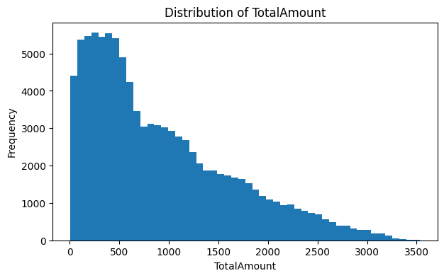
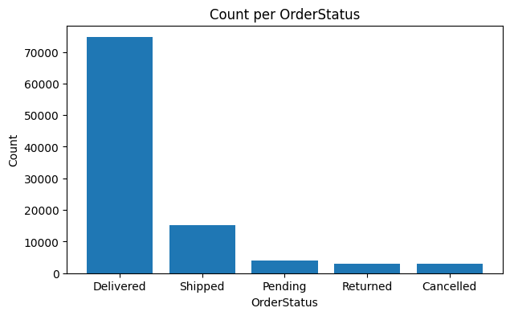

# Entrega Projeto I - Relatório

## 1. Introdução

O objetivo deste projeto é aplicar técnicas de MMachine Learning para prever status dos pedidos realizados na plataforma da Amazon, identificando se um pedido será entregue ou cancelado.
Este tipo de classificação se mostra util em sistemas reais, permitindo identificar riscos de cancelamento, auxiliar na logística e otimizar user experience.

## 2.  Conjunto de Dados
Após o carregamento inicial, o dataset possui diversas colunas relacionadas a:

Informações do produto

Informações financeiras

Informações do cliente

Status do pedido (variável alvo)

A variável OrderStatus foi filtrada para conter apenas duas classes:

Delivered

Cancelled

Principais observações iniciais:

Delivered é a classe majoritária.

Variáveis como TotalAmount, Quantity, UnitPrice, ShippingCost e Tax têm distribuição heterogênea.

Variáveis categóricas apresentam alta cardinalidade

## 3. Exploração dos Dados

Através da análise, foi possível perceber que a maiori parte dos pedidos foi marcado como Delivered, enquanto Cancelled é representado por uma fração bem pequena.

Isso acaba impactando de maneira negativa algumas métricas como a precisão e o F1, fazendo-se necessário utilizar outras métricas além de accuracy.

# 4.  Pré Processamento

Redução de cardinalidade (Top-K Categories):

Cada variável categórica foi reduzida às 10 categorias mais frequentes, agrupando o restante como "Other".

Esse procedimento impede explosão do número de colunas após o One-Hot Encoding.

Transformação dos dados:

Numéricos → imputação por mediana + padronização (StandardScaler)

Categóricos → imputação + OneHotEncoder (sparse_output=False)

Split dos dados:

80% treino
20% teste
Stratify aplicado para manter proporções de classe

# 5. Modelagem

Ao longo deste trabalho utiliozamos dois modelos principais. Um dos modelos é o Decision Tree Classificer, usado por sua facilidade de interpretação e por não depender de normalização dos dados para capturar relações não lineares entre as variáveis. Neste modelo, utilizamos uma busca de hiperparâmetros usando GridSearch, avaliando as configurações de profundidade máxima (5,10 e ilimitado) e diferentes valores de min_sample_split (2 e 10), tentando encontrar o melhor equilibrio entre complexidade e desempenho.
O segundo modelo foi o K-Nearest Neighbors (KNN), por se tratar de um método baseado em distâncias, isso faz com que ele seja sensível a escala das variáveis, com a presença de ruído e ao One-Hot Encoding. Também tentamos realizar uma busca de hiperparâmetros para este modelo, variando os valores de vizinhos (3,5 e 7) e tipo de ponderação das distâncias entre uniform e distance.

Para os dois modelos, a avaliação foi feita usando métricas adequadas ao problema de classificação binária, especialmente considerando que a classe Cancelled é menor no conjunto de dados. As métricas calculadas incluíram accuracy, precision, recall e F1-score para a classe de cancelamentos, além da matriz de confusão e da curva ROC AUC quando disponível. Como o desbalanceamento é significativo, métricas como recall e F1-score possuem maior relevância do que a própria accuracy, já que indicam a capacidade do modelo de identificar corretamente os pedidos cancelados. A matriz de confusão, por sua vez, auxilia na visualização direta dos erros, especialmente no número de cancelamentos reais que foram classificados incorretamente como entregues.

Considerando o comportamento do dataset analisado, o modelo Decision Tree tende a apresentar melhor desempenho em termos de F1-score para a classe Cancelled, pois consegue explorar relações complexas entre variáveis sem ser prejudicado . Já o KNN costuma ter desempenho inferior nesse cenário por conta da alta dimensionalidade gerada pelo One-Hot Encoding e à sua sensibilidade à escala.

# 6. Conclusão

A análise de importância das variáveis no modelo Decision Tree nos mostrou que algumas features exercem maior influência sobre a previsão do status do pedido. Entre elas, TotalAmount, UnitPrice e Quantity, além das categorias do One-Hot Encoding, como Category e Brand. Esses resultados indicam que o valor total da compra, as características do produto e até mesmo a marca estão diretamente relacionados à probabilidade de um pedido ser cancelado.

O modelo Decision Tree apresentou melhor desempenho em relação ao KNN, especialmente durante a identificação da classe minoritária, ainda que o desbalanceamento do conjunto de dados continue limitando o recall de pedidos cancelados. Isso mostra que, em ainda há espaço para melhorias significativas apesar do modelo conseguir detectar certos padrões.

É recomendado para trabalhos futuros a aplicação de métodos de balanceamento, como SMOTE ou o uso de class_weight, para aumentar a sensibilidade do modelo aos cancelamentos. Além disso, modelos como RandomForest, XGBoost e LightGBM, costumam oferecer melhor capacidade de generalização e podem capturar relações mais complexas entre as variáveis. Também é recomendável colocar no conjunto de dados variáveis temporais — como mês, dia da semana ou indicadores de sazonalidade — e criar features comportamentais relacionadas ao histórico de compras dos clientes.