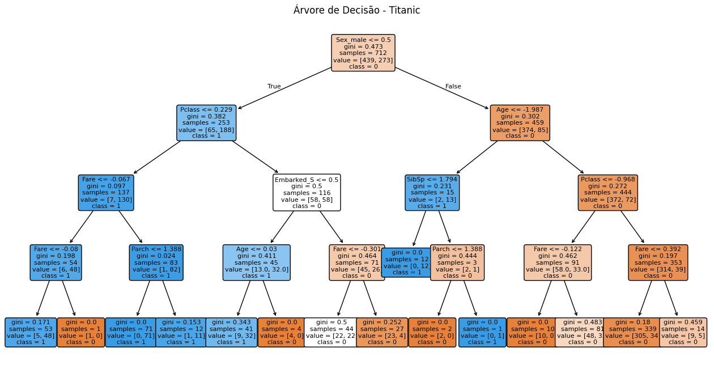

# Relatório – Classificação com Árvore de Decisão

## 1. Introdução

O objetivo deste projeto é utilizar o modelo de Árvore de Decisão para prever asobrevivência dos passageiros do Titanic, baseado em atributos demográficos e socioeconômicos que o próprio dataset disponibiliza.

A idéia consiste em treinar um modelo supervisionado de classificação binária que consiga distinguir entre:

Classe 0 - Não Sobreviveu

Classe 1 - Sobreviveu

## 2. Exploração dos Dados

Este dataset é composto pelas seguintes features:

- Sex
- Age
- PClass (Classe Social)
- Fare
- Relação Familiar
- Local de Embarque

Durante uma análise inicial é possivel determinar que **sexo** é um fator determinante, mostrando que as mulheres tiveram uma taxa de sobreivência muito superior aos homens. Outro fator determinante nesta análise foi a Classe Social, é possível notar que passageiros da primeira classe sobreviveram bem mais em relação aos outros. Por último temos a variável de idade que apresenta uma distribuição variada, porém, constitui majoritariamente de Crianças e Pessoas entre 20 e 40 anos.

É importante ressaltar que a nossa variável alvo possui uma clara discrepância, onde existem muito mais passageiros que não sobreviveram em relação aos sobreviventes.

## 3. Pré-Processamento 

Para o pré-processamento realizamos as seguintes etapas:

- Remoção de colunas que não nos auxiliam de maneira alguma.
- Tratamento de valores ausentes.
- Conversão das nossas variáveis categórias através do one-hot encoding.
- Utilização do StandarScaler em variáveis numéricas.
- Separação das Features e Target (X , y respectivamente).

## 4. Divisão de Dados
Os dados foram dividos em:

 - 80% para treino.
 - 20% para teste.

 Utilizei a estratificação para garantir a preservação da proporção entre as pessoas que sobreviveram e as que não sobreviveram.


 ## 5. Treinamento do Modelo
 
 O modelo que usei foi:

 ```python
DecisionTreeClassifier(
criterion="gini",
max_depth=4,
random_state=42
)
```

## 6. Estrutura da Árvore de Decisão

A imagem abaixo é nossa árvore de decissão já treinada:



O primeiro split utiliza Sex_male <= 0.5, separando todas as mulheres  e todos os homens . Representando o padrão histórico, mulheres tiveram maior taxa de sobrevivência no Titanic.
A partir disso, a árvore aplica divisões adicionais usando variáveis como Pclass, Age, Fare e Embarked, buscando sempre formar grupos o mais homogêneos possível.

## 7. Avaliação do Modelo

 ```
               precision    recall  f1-score   support

           0       0.77      0.94      0.84       110
           1       0.84      0.55      0.67        69

    accuracy                           0.79       179
   macro avg       0.81      0.74      0.76       179
weighted avg       0.80      0.79      0.78       179

```
Classe 0 - Não Sobreviveu

Recall de 94% nos indica que o modelo consegue identificar quase todas as pessoas que morreram. Já a precisão apresentou valor de 77% , resultando em uma porcentagem pequena de erro com os não sobreviventes.

Classe 1 - Sobreviveu

Recall de 55% nos indicando que o modelo acerta aproximadamente metade das vezes os sobreviventes com uma precisão de 84%.

Em conclusão o modelo consegue detectar óbitos com excelencia, porém o mesmo tem bastante dificuldade em identificar sobreviventes.

## 8. Conclusão

O modelo de Árvore de decisão foi capaz de identificar os principais padrões do dataset do Titanic como as mulheres terem maior probabilidade de sobrevivencia e Classe social ter um forte impacto nos resultados.
No geral o modelo apresentou um bom desempenho em prever não sobreviventes, desempenho moderado em prever os sobreviventes com uma acurácia geral de ~ 80%. Alguns ajustes válidos para futuros trabalhos é a mudança de hiperparametros, após uma análise a árvore estava com parametros muito conservadores.


