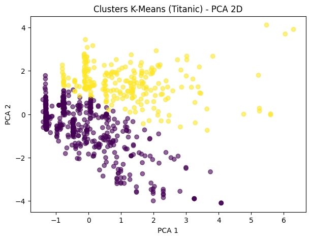

# Relatório – Agrupamento com K-Means aplicado ao Titanic

## 1. Introdução

O objetivo deste trabalho é aplicar o algoritmo de agrupamento K-Means no dataset visto em aula Titanic, explorando métodos de identificar padrões que se aproximem da variável Survived.

## 2. Descrição do Dataset

O conjunto de dados utilizado contém informações socioeconômicas e demográficas dos passageiros do Titanic. As variáveis selecionadas para o agrupamento foram:
- Pclass
-Sex 
-Age
-SibSp
-Parch
-Fare

A variável Survived foi usada apenas para avaliação dos clusters.

Todos os valores ausentes vistos nas variáveis Age e Fare , foram tratados utilizando o valor da Mediana, assim como todas as variáveis numéricas foram padronizadas usando a classe StandardScaler

## 3. Metodologia

O algoritmo K-Means foi utilizado com os seguintes parametros:

n_clusters = 2 (sobreviveu / não sobreviveu)

random_state = 42

n_init = 10

Após o treinamento, foi realizada a associação entre cada cluster e a classe real predominante (mapping).

## 4. Resultados

O gráfico PCA 2D mostra duas regiões com sobreposição entre grupos. A separação é mais clara em relação ao sexo e a classe socio economica, características que exercem forte influência na sobrevivência de acordo com o dataset.

Após mapear os clusters para as classes reais, foram obtidos os seguintes valores:

Accuracy: 0.6745

Adjusted Rand Index (ARI): 0.1118

Normalized Mutual Information (NMI): 0.0624

O ARI mede a similaridade entre clusters e classes levando em conta pares rotulados corretamente por acaso. O NMI mede quanto de informação os clusters compartilham com a variável Survived.

A matriz de confusão obtida foi:

[ [450, 99],
  [191, 151] ]

A maior parte dos erros encontra-se na classe "Sobreviveu", indicando que o K-Means agrupou melhor os passageiros que não sobreviveram. Isso é compatível com a maior homogeneidade desse grupo em comparação aos sobreviventes, já que a distribuição envolve mais variáveis combinadas (idade, sexo, classe e tarifa).

## 5. Discussão

Embora o K-Means não utilize os rótulos para formar clusters, foi capaz de capturar padrões estruturais do dataset, especialmente associados às variáveis Sex e Pclass.
O desempenho médio do modelo observado nas métricas é esperado porque:

- Os sobreviventes formam um grupo mais heterogêneo.

- O algoritmo assume agrupamentos redondos e balanceados, o que não ocorreu.

- A distribuição real das classes é desigual.

Mesmo assim, o modelo conseguiu separar alguns perfis incomuns, principalmente passageiros do sexo feminino e de classes sociais mais altas.

## 6. Conclusão

O uso do K-Means no dataset Titanic nos mostrou que a estrutura dos dados possui padrões detectáveis mesmo sem supervisão.

A correspondência parcial entre clusters e classes reais nos mostra que variáveis como sexo, classe do passageiro e tarifa influenciam significativamente os agrupamentos que foram formados.