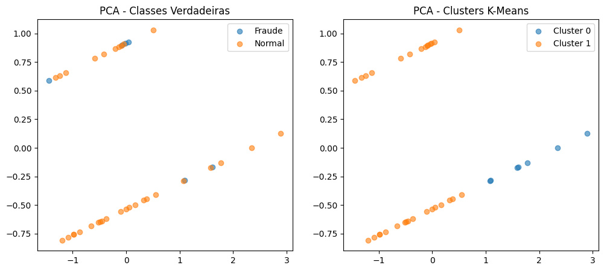

# Relatório - Entrega Metrics and Evaluation

## 1. Introdução

O objetivo deste trabalho é aplicar dois métodos diferentes ao dataset de Fraude, o algoritmo supervisionado KNN e o algoritmo não supervisionado K-means.
O foco será avaliar o desempenho de cada algoritmo na identificação de registros de "Fraude" ou "Normal".

## 2. Descrição do Dataset

O conjunto de dados contêm três variáveis:

- Valor
- Periodo
- Classe (Fraude ou Normal)

Durante o pré-processamento os valores faltantes foram substituidos pela mediana no caso da variável Valor, e  no caso da variável Periodo foi substituido por "Desconhecido".
Além dessas substituições a variável Valor foi padronizadda utilizando o StandardScaler e a variável Periodo foi convertido utilizando OneHotEncoder.

O conjunto foi separado em treinamento e teste usando a proporção 75%/25%.

## 3. Modelo Supervisionado – KNN
Configuração do Algoritmo
- k = 5

Resultados obtidos:
Accuracy: 0.80
Precision (macro): 0.40
Recall (macro): 0.50
F1 (macro): 0.44

3.3 Matriz de Confusão (KNN)
[[0 2]
 [0 8]]

Interpretação:

O modelo conseguiu classificar corretamente 8 registros da classe “Normal”.

Ele errou todas as identificações da classe "Fraude".

Esse comportamento indica que o modelo priorizou a classe majoritária e não conseguiu capturar padrões suficientes para distinguir casos de fraude.

## 4. Modelo Não Supervisionado – K-Means

Configuração do Algoritmo:

Número de clusters: 2

Inicializações: n_init = 10

O numero de clusters corresponde as duas classes "Fraude" e "Normal"

Resultados do modelo:

Adjusted Rand Index (ARI): 0.10145
Normalized Mutual Information (NMI): 0.02680
Acurácia após mapeamento: 0.84210

4.3 Matriz de Confusão (K-Means mapeado)
[[ 0  6]
 [ 0 32]]

Interpretação:

- Todos os registros de "Fraude" cairam, no mesmo cluster.
- O agrupamento acabou reproduzindo só a estrutura da classe "Normal".
- O modelo não formou nenhum grupo para a classse "Fraude".

Essa matriz confirma que o K-means se ajustou ao padrão que domina o dataset, sem reconhecer nenhuma caracteristica das fraudes.

## 5. Visualização PCA

## 6. Conclusão

A aplicação dos métodos supervisionado (KNN) e não supervisionado (K-Means) ao dataset fraude.csv mostrou limitações na distinção entre transações “Fraude” e “Normal”.
O KNN apresentou boa acurácia global (0,80), mas isso ocorre por conta da classe “Normal” ser majoritária no conjunto de dados. O modelo não conseguiu identificar nenhum caso de fraude no conjunto de teste, evidenciado pela matriz de confusão e pelos valores reduzidos de precisão e recall para a classe menor. Esse comportamento indica que as variáveis disponíveis não oferecem separação suficiente para discriminar fraudes com o método utilizado.

O K-Means apresentou métricas coerentes com a natureza não supervisionada do método e com a estrutura dos dados. Os valores muito baixos de ARI (0,10) e NMI (0,02) mostram que os clusters encontrados não correspondem à separação real das classes. Mesmo após o mapeamento, a acurácia elevada (0,84) reflete apenas o desbalanceamento do dataset, já que todos os registros de fraude foram absorvidos pelo cluster dominante. A análise visual por PCA confirma a ausência de fronteiras claras entre as duas classes.

Os resultados indicam que o conjunto de atributos disponível não apresenta poder discriminativo suficiente para modelos simples como KNN ou para agrupamento via K-Means. Tanto a distribuição linear dos dados quanto o desbalanceamento afetam  o desempenho dos métodos. Para melhorar a detecção de fraudes, seria necessário mais variáveis relevantes, reduzir o desbalanceamento e empregar algoritmos mais robustos para a classe menor.