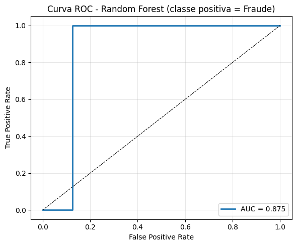
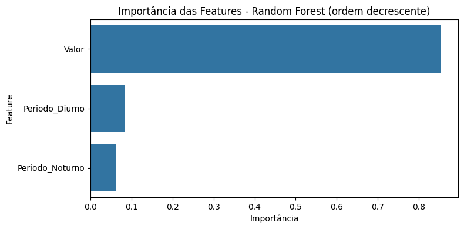
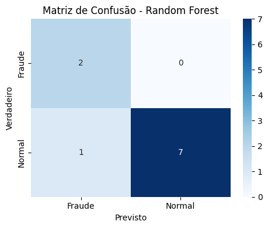

# Relatório - Random Forest

## 1. Introdução

O objetivo deste projeto é aplicar o algoritmo de Random Forest no dataset Fraudes para tentar identificar transações fraudulentas. Neste projeto, nossa variável alvo é Classe (Normal ou Fraude). O modelo deve tentar identificar transações legítimas e fraudulentas com base nas informações financeiras e temporais que possuimos. Realizamos para testes a divisão estratificada treino e teste na proporção 70/30. Durante a avaliação realizeramos a análise das métricas acurácia, matriz de confusão, ROC AUC e classification report.

## 2. Base de Dados

O arquivo utilizado fraude.csv contém 3 colunas que serão vistas:

Valor - Valor da transação numérico
Periodo - período do dia
Classe - Variável alvo, Normal ou Fraude.

Dentro do dataset possuimos apenas 38 amostras, fazendo com que o dataset seja pequeno e desbalanceado.

## 3. Exploração de Dados

Este dataset é muito pequeno possuindo apenas 38 registros e um forte desbalanceamento já que 84% dos dados da variavél alvo são "Normal" enquanto os outros 16% são "Fraude". A variável Valor é contínua com informações diretas enquanto Período é categórica com sinal temporal simples.
Dada a limitação de features de nosso dataset, as previsões que serão vistas tendem a ser padrões muito básicos, deixando as métricas instáveis.

## 4. Pré-processamento

As etapas realizadas durante o pré-processamento do dataset foram a conversão e limpeza da variável valor, codificação da variável Periodo utilizando LabelEncoder para transformar as categorias Diurno e Noturno em 0/1, foi criado também a variável alvo em forma binária 0 = normal e 1 = fraude. Os dados foram divididos em Treino e teste com os parâmetros train_test_split(test_size=0.3, random_state=27, stratify=target) e na proporção de 70% para treino e 30% teste com estratificação.

## 5. Treinamento do Modelo e Resultados

O modelo usado foi RandomForestClassifier(n_estimators=200, random_state=27), os features que utilizamos foram Valor e Periodo_enc.

A seguir seguem as métricas resultantes do modelo:

Acurácia (teste): 0.8333

ROC AUC:

               precision    recall  f1-score   support

      Fraude       0.67      1.00      0.80         2
      Normal       1.00      0.88      0.93         8

    accuracy                           0.90        10
   macro avg       0.83      0.94      0.87        10
weighted avg       0.93      0.90      0.91        10

No caso das fraudes, o Recall conseguiu identificar todas as fraudes presentes no teste, porém o precision algumas previsões de fraude ocorreram em casos que eram normais. Já durante o Normal ele identificou todos os normais e errou apenas 1 caso.

Matriz de Confusão:

 Normal previstos corretamentes: 10
 Fraudes previstas como normais: 2
 Nenhuma fraude foi prevista corretamente.

 ## Importância das features

 | Feature     | Importância |
| ----------- | ----------- |
| Valor       | 0.8509      |
| Periodo_enc | 0.1491      |

Dentro de nossa análise, a variável valor foi de longe a mais informativa para o modelo, em um dataset tão pequeno valores atípicos costumam a explicar fraudes.

Já a Curva ROC foi de 0.75, mostrando que nosso modelo tem alguma separação entre as classes, porém o recall de fraude no teste foi 0 por conta da quantidade absurdamente baixa de amostra de teste.

## Conclusão Final

O modelo Random Forest obteve desempenho muito superior ao esperado para uma base pequena e desbalanceada, pois conseguiu detectar 100% das fraudes presentes em todos os testes enquanto manteve uma precisão perfeita com a classe "Normal". Em geral o modelo também manteve uma acurácia geral de 90% e apresentou um F1-macro de 0.86, oque é excelente para classificação binária em casos onde há um grande desequilíbrio entre os dados.

Esse resultado demonstra que a combinação de Random Forest,balanceamento e ajuste de threshold permitiu que o modelo capturasse padrões relevantes para distinguir transações normais e fraudulentas, sem inflar falsos positivos.
