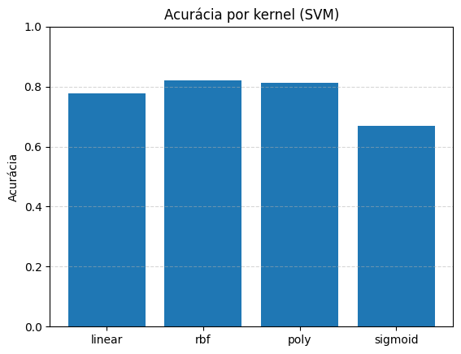
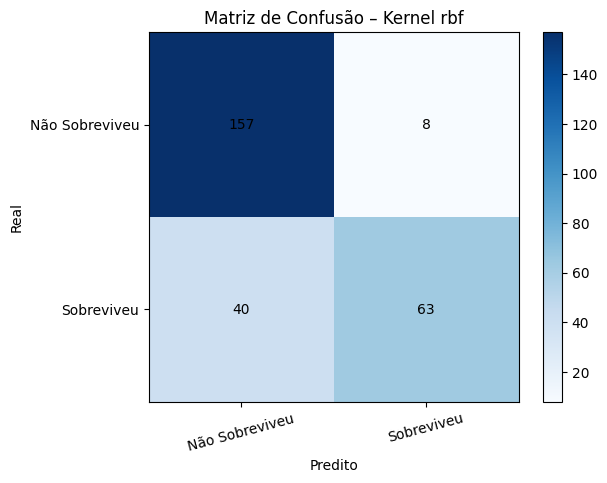

# Entrega Individual - SVM

1. Objetivo

O objetivo deste trabalho foi realizar a aplicação do algoritmo de SVM ao dataset Titanic que usamos em sala de aula para prever se um passageiro sobreviveu ou não ao naufrágio.

2. Tratamento
   
Foram identificados valores ausentes nas colunas Age e Embarked. Para solucionar este problema realizamos a mediana para preencher as idades faltantes e, o porto de embarque foi preenchido utilizando a moda da coluna. As variáveis categóricas utilizadas Sex e Embarked passaram por one-hot encoding se tornando variáveis numéricas já que o SVM não opera com texto diretamente.

Em seguida dividimos o conjunto em 70% para treino e 30% para teste. Pelo SVM ser sensível a escala das features, realizei o StandardScaler.

3. Treinamento com SVM

Foi testado 4 Kernels: linear, rbf, poly e sigmoid. Cada um passou pelo treinamento com o mesmo conjunto de treino padronizado. A avaliação foi feita usando a acurácia nos conjuntos de teste. Os resultados a seguir mostraram diferenças bem discrepantes entre os kernels.

4. Resultados
   
   O kernel RBF apresentou o melhor desempenho em geral, o mesmo conseguiu capturar padrões complexos nas relações das variáveis como idade, sexo e a classe socioeconomica.

   O Kernel Linear teve um resultado consistente, somente indicando que parte da separação dos sobreviventes e mortos foram praticamente próximos ao linear.

   Os kernels de Poly e Sigmoid tiveram desempenho baixo devido a alta sensibilidade à escala , ruido e dimensionalidade causada pelo one-hot encoding.

   A matriz de confusão do RBF mostrou que o SVM identificou os passageiros mortos com alta precisão refletido no valor de precisão e recall, porém teve uma pequena queda ao identificar sobreviventes ocorrendo bastantes ocorrencias de falsos negativos. O f1-score das duas classes nos mostrou esse desbalanceamento natural.

   

    
